 
# Blueprint Management 4 - Heavy Clients

*	Add to the canvas of the page an event handler that allows you to capture the 'clicks' made, either through the mouse, or through a touch screen. For this, consider this example of the use of events of type PointerEvent (not yet supported by all browsers) for this purpose. Remember that unlike the previous example (where the JS code is embedded in the view), it is expected to have the initialization of the event handlers correctly modularized, as shown in this codepen.

*	Add what is needed in your modules so that when new points are captured on the open canvas (if a canvas has not been selected, nothing should be done):

	*	The point is added at the end of the sequence of points on the current canvas (only in the application memory, NOT EVEN IN THE API!). 

	*	The drawing is repainted. 
	
	Se añade un evento que captura los clicks en el canvas.
	
	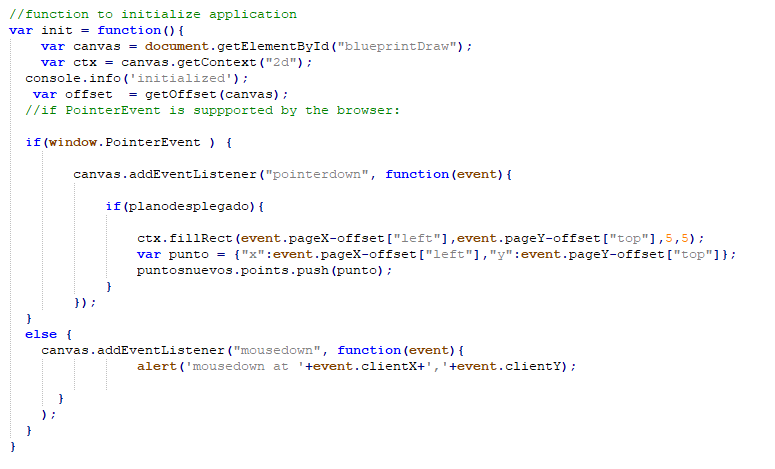
	
	Los puntos quedan grabados en el canvas.
	
	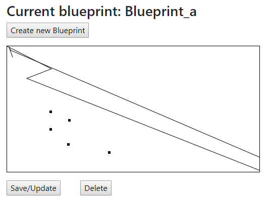

*	Add the Save/Update button. Respecting the client's current module architecture, do that by pressing the button:

	*	Perform PUT action, with the updated plan, in its corresponding REST resource. 

	*	Perform GET action to the resource /blueprints, to get back all the plans made. 

	*	The total points of the user are recalculated. 

	Se crea una nueva funcion que usa "promises" para ejecutar primero el PUT y de inmediato el GET en el momento que se llama al boton Save/Update.
	
	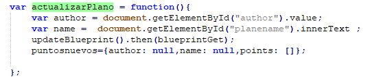
	
	Funcion que implementa el PUT
	
	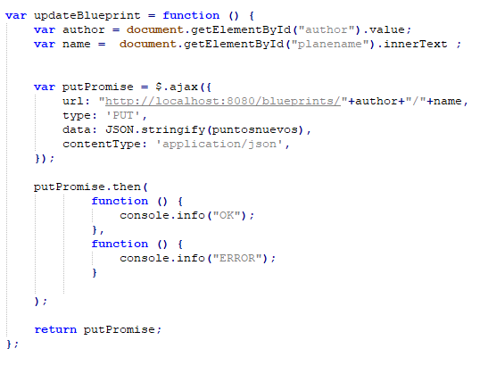
	
	Funcion que implementa el GET
	
	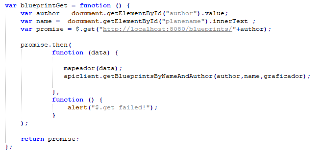
	
	Momento antes de llamar al boton Save/Update.
	
	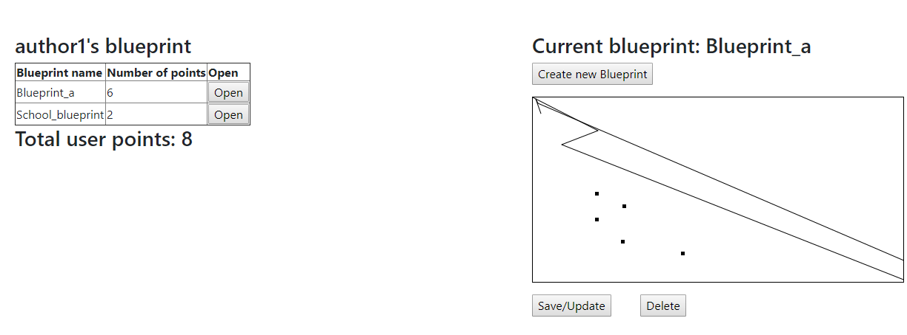
	
	Momento despues de llamar al boton Save/Update.
	
	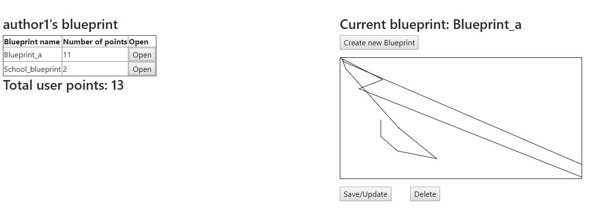

*	Add the 'Create new blueprint' button, so that when pressed:

	*	The current canvas is deleted. 

	*	The name of the new 'blueprint' is requested (you decide how to do it). 

	*	This option should change the way the 'save / update' option works, because in this case, when pressed the first time you should (also, using promises):

		*	Post the resource / blueprints to create the new plan. GET to this same resource, to update the list of plans and the user's score. 
	
	Funcion que usa "promises" para ejecutar primero el POST y de inmediato el GET en el momento que se le da un nombre al nuevo Blueprint.
	
	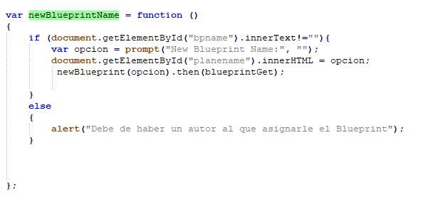
	
	Funcion que implementa el POST.
	
	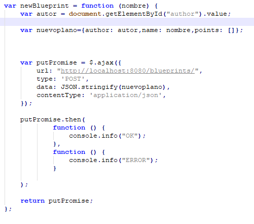
	
	Momento en que se pide el nombre del nuevo Blueprint.
	
	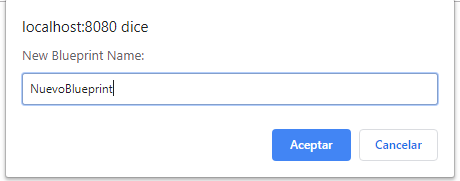
	
	Nuevo Blueprint en blanco.
	
	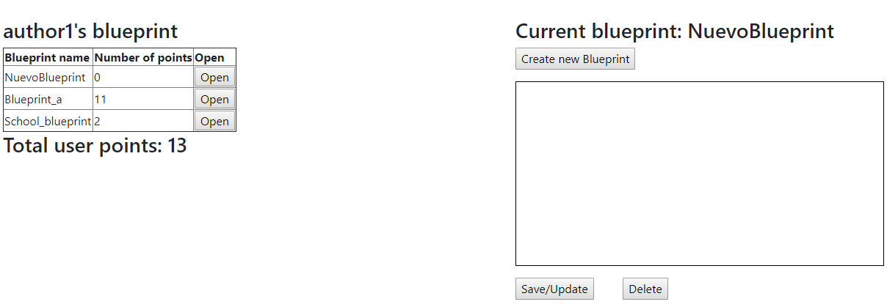
	

*	Add the 'DELETE' button, so that (also with promises):

	*	Delete the canvas. DELETE the corresponding resource. 

	*	Make GET of the plans now available.
	
	
	Funcion que usa "promises" para ejecutar primero el DELETE y de inmediato el GET en el momento que se llama al boton DELETE.
	
	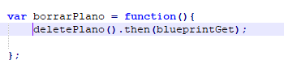
	
	Funcion que implementa el DELETE.
	
	
	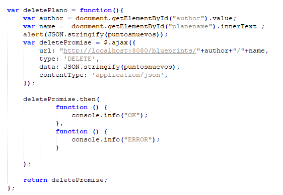
	
	
	